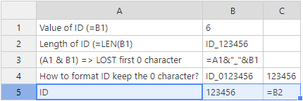
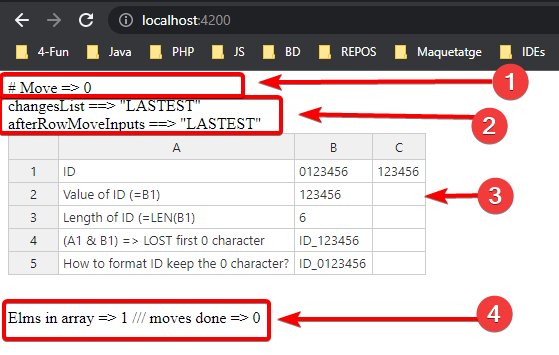
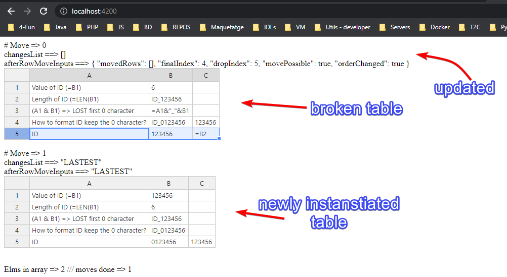

# TestHfHot

This project aims to move rows in a `Handsontable` while updating the `Hyperfomula` instance attached to it. Therefore, it should work as follow:
* **Move 1 (or more if possible) row** in the displayed `Handsontable` table **to another row**.
* **Before the `Handsontable` starts rendering**, the `Hyperfomula` instance should be updated already with the **formulas recalculated**.
* **The re-rendered `Handsontable` shouldn't have any row wrongly displayed**.

It has to work in `Google Chorme` and `Microsoft Edge` (if works in `Mozilla Firefox` also better)

## Terminilogy
* **Show =>** What the end user sees, *when entering* the cell to edit.
* **Display =>** What the end user sees, *without entering* the cell to edit, just watching without touching anything.

## Example table

|  | A | B | C |
| :---: | :---: | :---: | :---: |
| **1** | ID  | 0123456 | =B2 | 
| **2** | Value of ID (=B1)  | =B1  | *{EMPTY}* |
| **3** | Length of ID (=LEN(B1) | =LEN(B1) | *{EMPTY}* |
| **4** | (A1 & B1) => LOST first 0 character | =A1&"_"&B1 | *{EMPTY}* |
| **5** | How to format ID keep the 0 character? | ID_0123456 | *{EMPTY}* |

### Notes
* The **cell B2 displays** the content of **B1**, which is `0123456`.
* The **cell C2 displays** the content of **B2** which is the content of **B1**... but it **removes the trainig zeros**, so it shows `123456`.
    * The trailing zeros removal is not an issue in this topic since we just want to check that the formula chains work.
* The **cell B3 displays** the length content of **B2** which is the content of **B1**... but it **removes the trainig zeros**, so it shows `6`.
* The **cell B4 displays** concatenation of **A1** and **B1** (again without zeroes) with an `_` so it shows `ID_123456`.

```diff
+ It is expected to keep displaying these values while updating the formula correctly while moving.
```

## Issues

None of the criteria above is met today 2022-10-25. What we see is:
* **Into `afterRowMove` hook `Handsontable` the `Hyperfomula` instance does not have move informed**. This causes:
    * The table displays OK after the re-render, but the shown formulas are not updated. This makes it **unconsistent with what the end user is seeing**.
* If we use the `afterRowMove` hook from `Handsontable`, then MANUALLY we can use `moveRows` functionality from `Hyperfomula`. We see 2 problems here:
    * The expected output `ExportedChange[]` is empty.
    * After the re-render finishes, we see that:

        

        * Some formulas now shows the right formula, but it remains un-calculated (the displayed value is the formula, not the calculated result).
        * Some formulas shows a wrong formula, but they display OK.

## Explaining the showroom

Please install Angular Cli to be able to follow this part.

To run it just type on the terminal `npm install` on the root folder. Then, `ng serve` ==> The project will run at `http://localhost:4200`.

There is a single component, which is placed on the root URL.

### What you will see?

Several tables will be printed here but they are product of a `ngFor`. Let's explain one in detail:



1. `# Move => 0` ==> The table below will be the one that.
2. The rellevant data taht is left AFTER the move. If the move is still pending, `LASTEST` will be displayed.
    * `changesList ==> "LASTEST"` ==> The `moveRows` result from `Hyperfomula`.
    * `afterRowMoveInputs ==> "LASTEST"` ==> The `afterRowMove` inputs from `Handsontable`.
3. The `Handsontable` instance itself.
4. How many elements are in the "Array `Handsontable` instances".

After moving `row 1` to `after row 5` will see...



## How we arrived at that point...

We first tried to simpply use the `afterRowMove` hook from `Handsontable`, but the `Hyperfomula` instance was unchanged and we need that instantce updated to the lastest update.

Then, we used the `moveRows` functionality from `Hyperfomula`, but then re-render failed.

Finally we tried to just crete multiple `Handsontable` tables, but in the real project it causes major troublesome making it impossible to fit in.

# Automatic README text from Angular CLI

This project was generated with [Angular CLI](https://github.com/angular/angular-cli) version 14.2.3.

## Development server

Run `ng serve` for a dev server. Navigate to `http://localhost:4200/`. The application will automatically reload if you change any of the source files.

## Code scaffolding

Run `ng generate component component-name` to generate a new component. You can also use `ng generate directive|pipe|service|class|guard|interface|enum|module`.

## Build

Run `ng build` to build the project. The build artifacts will be stored in the `dist/` directory.

## Further help

To get more help on the Angular CLI use `ng help` or go check out the [Angular CLI Overview and Command Reference](https://angular.io/cli) page.